  

  
  
  

## Wisp Science · Documentation & community

[**Wisp Science**](https://github.com/xuzhougeng/wisp-science) 由 **[徐洲更（Zhougeng Xu）](https://xuzhougeng.top/)** 开发，获得 **重庆医科大学附属第一医院[郭世朋教授](https://github.com/Shipeng-Guo)** 的支持，**[余光创教授](https://github.com/guangchuangyu)** 提供专业的论文指导意见。

我参与项目的文档维护、Issue 反馈与 PR 贡献。

**新媒体矩阵 · 微信公众号：果子学生信、洲更的第二大脑**

**[Wisp Science wolai 文档主要维护者](https://www.wolai.com/fUUMG9SHad3D8ugM4FMoy3)**  
Primary maintainer of the Wisp Science documentation on wolai.

**项目 Issue 提交数量排名第一 · 104 个 Issues**  
截至 2026-09-09，按公开仓库创建的 Issue 总数统计，包含已关闭 Issue，不包含 Pull Requests；此为 Issue 提交数量排名。

**5 个上游 PR · 全部已合并 · 2 个版本发布说明明确署名**

| Contribution | Merged PR |
| :--- | :--- |
| Local DNA import and sequence-selection integration | [#965](https://github.com/xuzhougeng/wisp-science/pull/965) |
| Multilingual skill-search recall | [#959](https://github.com/xuzhougeng/wisp-science/pull/959) |
| Runtime-Aware Agent Context design proposal | [#795](https://github.com/xuzhougeng/wisp-science/pull/795) |
| Model search and skill-to-workflow model binding | [#721](https://github.com/xuzhougeng/wisp-science/pull/721) |
| Workflow budget and schema hints | [#720](https://github.com/xuzhougeng/wisp-science/pull/720) |

发布说明中的贡献署名：**[v1.7.0 · Trace & Trust](https://github.com/xuzhougeng/wisp-science/releases/tag/v1.7.0)**（#959、#965）和 **[v1.2.0 · Exploration](https://github.com/xuzhougeng/wisp-science/releases/tag/v1.2.0)**（#795）。

统计截至 2026-09-09，仅计 xuzhougeng/wisp-science 上游仓库；版本数按 GitHub Release 正文明确出现 @Yu-Qiao-sjtu 的不同版本去重，不代表代码仅用于这些版本。

[**阅读 wolai 文档 →**](https://www.wolai.com/fUUMG9SHad3D8ugM4FMoy3) · [**Wisp Science 项目 →**](https://github.com/xuzhougeng/wisp-science) · [**我的 Issues →**](https://github.com/xuzhougeng/wisp-science/issues?q=is%3Aissue%20author%3AYu-Qiao-sjtu)

## GitHub activity

  

  
  

## Hi, I'm Yu Qiao

I explore the intersection of biological questions, computational analysis, and AI-assisted research. Here I share tools for working with omics data, understanding papers, and making scientific workflows easier to reproduce.

**肿瘤免疫 × 生物信息学 × 科研 AI**  
从生物学问题出发，用代码连接数据、证据与发现。

## Research & building

| Biology | Computation | Research tools |
| :--- | :--- | :--- |
| Tumor immunology | Omics analysis | AI-assisted literature reading |
| Biological mechanisms | Pathway interpretation | Reusable scientific workflows |

## Selected publications

**2026 · Advanced Science**  
[LMO7 Suppresses Tumor-Associated Macrophage Phagocytosis of Tumor Cells Through Degradation of LRP1](https://scholar.google.com/citations?view_op=view_citation&hl=en&user=3xfQGl0AAAAJ&citation_for_view=3xfQGl0AAAAJ:W7OEmFMy1HYC)  
M. Li, T. Wang, Y. Zhong, et al. · Co-author  
Macrophage phagocytosis · Tumor microenvironment · LRP1

**2025 · Human Vaccines & Immunotherapeutics**  
[Research hotspots and frontier analysis of the novel immune checkpoint Nectin-4](https://scholar.google.com/citations?view_op=view_citation&hl=en&user=3xfQGl0AAAAJ&citation_for_view=3xfQGl0AAAAJ:Tyk-4Ss8FVUC)  
**Y. Qiao**, W. Zhao, Y. Gou, et al.  
Immune checkpoints · Nectin-4 · Bibliometric analysis

**2024 · Acta Pharmacologica Sinica**  
[Recombinant human adenovirus type 5 promotes anti-tumor immunity via inducing pyroptosis in tumor endothelial cells](https://scholar.google.com/citations?view_op=view_citation&hl=en&user=3xfQGl0AAAAJ&citation_for_view=3xfQGl0AAAAJ:qjMakFHDy7sC)  
Z. Wang, M. Li, Q. Yang, et al. · Co-author  
Anti-tumor immunity · Tumor endothelium · Pyroptosis

[**Explore all publications on Google Scholar →**](https://scholar.google.com/citations?user=3xfQGl0AAAAJ&hl=en)

## Selected public projects

| Project | What you'll find |
| :--- | :--- |
| [**Wisp_skills**](https://github.com/Yu-Qiao-sjtu/Wisp_skills) | A collection of skills for scientific AI workflows. |
| [**biofree.qyKEGGtools**](https://github.com/Yu-Qiao-sjtu/biofree.qyKEGGtools) | R tools for working with KEGG. |
| [**Pro. Paper**](https://github.com/Yu-Qiao-sjtu/Pro.-Paper) | AI-assisted paper reading and structured research reports. |
| [**Yuanclaw**](https://github.com/Yu-Qiao-sjtu/Yuanclaw) | Modular analysis for bulk RNA-seq, microarray and pseudobulk data. |

Curious about biology. Thoughtful about evidence. Always building.

