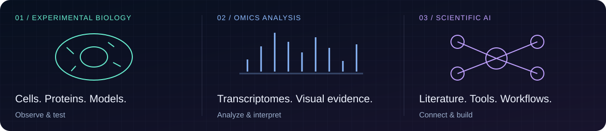
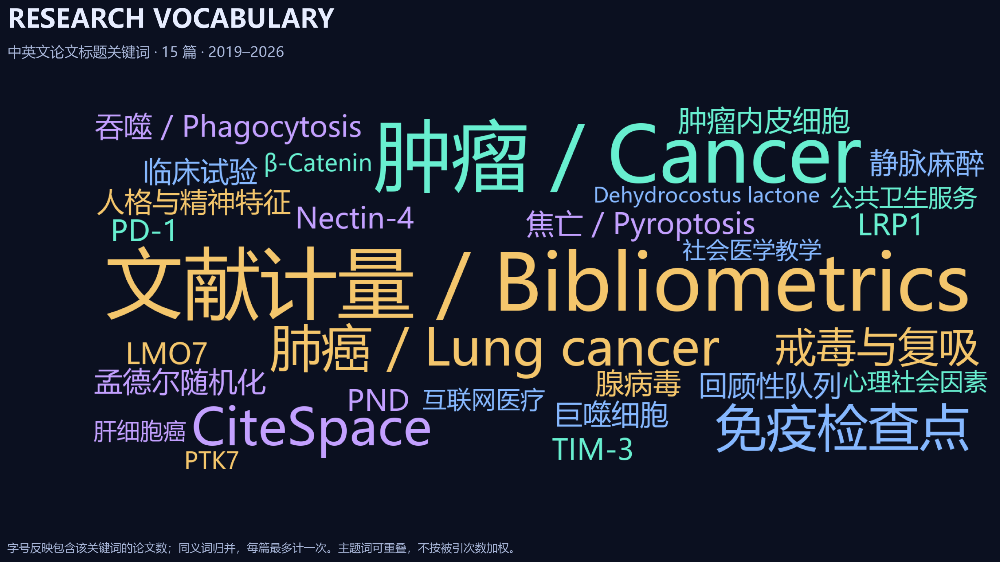
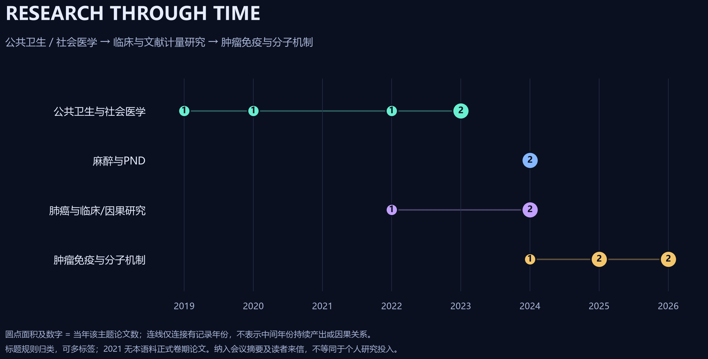

  

  
  
  
  

## Wisp Science · Documentation & community

[**Wisp Science**](https://github.com/xuzhougeng/wisp-science) 由 **[徐洲更（Zhougeng Xu）](https://xuzhougeng.top/)** 开发，获得 **重庆医科大学附属第一医院[郭世朋教授](https://github.com/Shipeng-Guo)** 的支持，**[余光创教授](https://github.com/guangchuangyu)** 提供专业的论文指导意见。

**学术指导 · 余光创教授（Guangchuang Yu）**

余光创教授是**南方医科大学教授、博士生导师**，长期从事生物信息学方法与开源工具开发，研究覆盖组学数据解释、系统发育与科学可视化。[学校介绍](https://www.smu.edu.cn/info/1251/20909.htm)

他及其团队开发的代表性工具包括 **clusterProfiler**（功能富集与组学解释）、**ggtree / treeio**（系统发育树可视化与数据整合）、**ChIPseeker**（ChIP-seq 峰注释）和 **enrichplot**（富集结果可视化）。这些工具为研究者从基因列表、调控区域和进化关系中提取生物学意义提供了可复用的方法。[YuLab 开源工具](https://github.com/YuLab-SMU) · [个人软件主页](https://guangchuangyu.github.io/software/)

代表方法论文包括 *The Innovation* 的 [clusterProfiler 4.0（2021）](https://pmc.ncbi.nlm.nih.gov/articles/PMC8454663/) 和 *Nature Protocols* 的 [Using clusterProfiler to characterize multiomics data（2024）](https://www.nature.com/articles/s41596-024-01020-z)。

  

> **我的贡献｜我参与 Wisp Science 项目的文档维护、Issue 反馈与 PR 贡献。**

**新媒体矩阵 · 微信公众号：果子学生信、洲更的第二大脑**

**[Wisp Science wolai 文档主要维护者](https://www.wolai.com/fUUMG9SHad3D8ugM4FMoy3)** 
Primary maintainer of the Wisp Science documentation on wolai.

**项目 Issue 提交榜 · TOP 3**

**我的 Issue 提交数：104 · 排名第 1**

| 排名 | 贡献者 | Issue 提交数 |
| :---: | :--- | ---: |
| **1** | **[Yu-Qiao-sjtu](https://github.com/xuzhougeng/wisp-science/issues?q=is%3Aissue%20author%3AYu-Qiao-sjtu)** | **104** |
| 2 | [xuzhougeng](https://github.com/xuzhougeng/wisp-science/issues?q=is%3Aissue%20author%3Axuzhougeng) | 31 |
| 3 | [jarxunlai](https://github.com/xuzhougeng/wisp-science/issues?q=is%3Aissue%20author%3Ajarxunlai) | 14 |

[统计快照与口径](./research/wisp-issue-ranking.json)
 
截至 2026-09-09，按公开仓库创建的 Issue 总数统计，包含已关闭 Issue，不包含 Pull Requests；此为 Issue 提交数量排名。

**5 个上游 PR · 全部已合并 · 2 个版本发布说明明确署名**

我的 PR 贡献覆盖 **实验数据接入、技能检索、模型选择、工作流易用性与运行环境感知设计**，把科研使用中遇到的问题转化为具体功能改进和设计方案。

| 已合并 PR | 中文简述与实际价值 |
| :--- | :--- |
| [**#965 · DNA 文件导入与序列交互**](https://github.com/xuzhougeng/wisp-science/pull/965) | 支持本地 SnapGene、FASTA、GenBank 等文件导入，保留环状结构与注释；将选中片段的序列、坐标、链方向和长度传给聊天助手，衔接质粒查看与 AI 分析。 |
| [**#959 · 中英文技能搜索改进**](https://github.com/xuzhougeng/wisp-science/pull/959) | 改善连续中文、不同分隔符和跨语言查询下的技能检索，减少“技能已启用却找不到”的问题。 |
| [**#795 · 运行环境感知设计提案**](https://github.com/xuzhougeng/wisp-science/pull/795) | 提出让 Agent 感知已加载数据对象、查询科学计算库接口、了解长任务进度的设计，为减少重复操作与接口猜测提供方案。此项为已合并的设计文档。 |
| [**#721 · 模型发现与工作流绑定**](https://github.com/xuzhougeng/wisp-science/pull/721) | 增加模型搜索工具和工作流模型绑定参数，让 Agent 能按任务所需能力查找并选择模型，例如为图片理解任务选择支持视觉的模型。 |
| [**#720 · 工作流预算与输出说明**](https://github.com/xuzhougeng/wisp-science/pull/720) | 补充中英文预算提示、输入占位说明和输出格式说明，让用户理解留空预算的含义，更清楚地配置工作流。 |

发布说明中的贡献署名：**[v1.7.0 · Trace & Trust](https://github.com/xuzhougeng/wisp-science/releases/tag/v1.7.0)**（#959、#965）和 **[v1.2.0 · Exploration](https://github.com/xuzhougeng/wisp-science/releases/tag/v1.2.0)**（#795）。

统计截至 2026-09-09，仅计 xuzhougeng/wisp-science 上游仓库；版本数按 GitHub Release 正文明确出现 @Yu-Qiao-sjtu 的不同版本去重，不代表代码仅用于这些版本。

[**阅读 wolai 文档 →**](https://www.wolai.com/fUUMG9SHad3D8ugM4FMoy3) · [**Wisp Science 项目 →**](https://github.com/xuzhougeng/wisp-science) · [**我的 Issues →**](https://github.com/xuzhougeng/wisp-science/issues?q=is%3Aissue%20author%3AYu-Qiao-sjtu)

## Research opportunity · 张海波博士课题组招生

**生物信息学 × 呼吸系统疾病｜上海交通大学药学院｜硕士 / 博士**

**学术经历**

| 阶段 | 院校 / 单位 |
| :--- | :--- |
| 博士后 | 斯坦福大学 |
| 博士 | 上海交通大学药学院 |
| 硕士 | 上海交通大学药学院 |
| 本科 | 山东大学 |

欢迎对呼吸系统疾病、免疫机制与生物信息学交叉研究有兴趣的同学关注张海波博士课题组，交流硕士、博士报考意向。

### 优秀毕业生报道 · 从交大，启航

[**《优秀毕业生｜张海波：从交大，启航》**](https://mp.weixin.qq.com/s/wBcWf_ehG8bry3WuQdz6lA) · 上海交通大学药学院公众号 · 2023-07-07

报道介绍了她作为 **2023 届药理学博士毕业生** 的科研与成长经历，并记录了 **2023 年上海市优秀毕业生、2019–2020 年博士研究生国家奖学金**等荣誉。按该报道发布时的统计，她在博士期间参与发表 **11 篇 SCI 论文，其中第一作者及共同第一作者论文 7 篇**。

### Featured in Science · 2026 年第一作者代表作

**[Mucosal vaccination in mice provides protection from diverse respiratory threats](https://doi.org/10.1126/science.aea1260)** 
**张海波博士为第一作者** · Science, 2026 · DOI: 10.1126/science.aea1260

**一个核心问题：能否让肺部免疫系统对多种呼吸道威胁形成持久保护？**

该研究采用鼻内给药的脂质体疫苗配方，在小鼠中实现针对多种呼吸道病毒、细菌及过敏原的保护，持续至少三个月。机制上，疫苗诱导的记忆 T 细胞重塑肺泡巨噬细胞的功能，增强抗原呈递与抗病毒免疫，为广谱黏膜保护提供了实验依据。[论文摘要与作者信息](https://pubmed.ncbi.nlm.nih.gov/41712698/)

#### 新闻报道与专家评价

| 来源 | 报道与评价要点 |
| :--- | :--- |
| **Stanford Medicine · 2026-02-19** | 专题报道明确介绍张海波博士为第一作者，将这项小鼠研究描述为向通用疫苗目标迈出的重要一步。[官方报道](https://med.stanford.edu/news/all-news/2026/02/universal-vaccine.html) |
| **牛津大学 Daniela Ferreira 教授** | 肯定鼻内免疫带来广泛保护的潜力，特别强调研究对 T 细胞重塑肺泡巨噬细胞机制的解释；人体效果与保护时长仍待验证。[专家原文](https://www.sciencemediacentre.org/expert-reaction-to-study-in-mice-on-a-vaccine-for-various-pathogens/) |
| **伦敦卫生与热带医学院 Brendan Wren 教授** | 认为它可能提供一种有前景的疫苗新思路，同时强调需要对照研究与人体研究。[专家原文](https://www.sciencemediacentre.org/expert-reaction-to-study-in-mice-on-a-vaccine-for-various-pathogens/) |

以上为新闻报道与专家评论的中文概述，原文见链接。研究成果基于小鼠模型。

### 更多科研成果 · 肺部免疫与疾病机制

张海波博士也是 **Nature Communications（2024）** 哮喘加重研究的第一作者，研究 CUL5 如何调节肺泡巨噬细胞抗病毒免疫与中性粒细胞炎症。[论文](https://doi.org/10.1038/s41467-023-44168-0)

合作成果还涵盖 **Nature Microbiology** 的细菌性肺炎机制、**Journal of Experimental Medicine** 的过敏性哮喘机制，以及 **Cell Host & Microbe** 的微生物组与疫苗应答研究。[代表论文与来源 →](./research/haibo-zhang.md)

### 研究方向的演化

| 时间范围 | 基于发表论文归纳的研究主线 |
| :--- | :--- |
| **近三年 · 2024–2026** | 从病毒诱发哮喘加重中的肺泡巨噬细胞抗病毒免疫，延伸至肺纤维化、微生物组与疫苗应答，以及肺部黏膜免疫的广泛保护。 |
| **近五年 · 2022–2026** | 以肺部免疫调控为主线，连接 E3 泛素连接酶、巨噬细胞功能、过敏性炎症及宿主–病原体互作；逐步拓展至组织重塑与系统免疫学。 |

生物信息学与上述问题的结合点包括：转录组发现候选调控因子、多组学解析免疫应答，以及将数据中的信号与疾病模型中的机制验证相连接。

[**查看 Google Scholar 论文列表 →**](https://scholar.google.com/citations?hl=en&user=THSReNEAAAAJ&view_op=list_works&sortby=pubdate) · [**阅读研究方向与代表成果 →**](./research/haibo-zhang.md)

招生信息由主页维护者提供，更新于 2026-09-09；招生单位为上海交通大学药学院，面向硕士、博士。具体招生资格、名额、申请时间与流程以学校和课题组正式通知为准。研究方向按自然年归纳，2026 年截至更新日。

## Biology × Omics × Scientific AI

**我是乔宇，来自上海交通大学，关注肿瘤、呼吸系统炎症性疾病与巨噬细胞、中性粒细胞，以及生物信息学与 AI4Drug。** 
连接肿瘤生物学实验、组学数据分析与科研 AI 应用。

My work connects **experimental biology, transcriptomics, and AI-assisted research** — from biological questions to interpretable evidence and reusable workflows.

我关注肿瘤免疫与生物学机制，也参与科研工具的文档维护、使用反馈和功能贡献。实验提供观察，组学帮助组织证据，科研 AI 帮助衔接文献、数据与分析过程。

[论文与引用](https://scholar.google.com/citations?user=3xfQGl0AAAAJ&hl=en) · [我维护的 Wisp Science 文档](https://www.wolai.com/fUUMG9SHad3D8ugM4FMoy3)

## Experimental & computational skills · 实验与计算技能

| 领域 | 技能 |
| :--- | :--- |
| 蛋白实验 | 真核及原核蛋白表达与纯化、SDS-PAGE、Western blot |
| 动物模型 | 小鼠皮下瘤、肺纤维化、哮喘及急性肺损伤模型；气管给药、肺组织取材 |
| 细胞实验 | 细胞培养 |
| 组学数据分析 | 转录组上游分析及下游可视化；单细胞测序下游可视化分析 |

## Selected work · 从能力到作品

### 01 / Experimental biology · 肿瘤免疫与实验研究

我的实验技能覆盖蛋白表达与纯化、细胞培养及小鼠疾病模型。参与发表的机制研究涉及肿瘤相关巨噬细胞吞噬、LRP1 调控，以及肿瘤内皮细胞焦亡与抗肿瘤免疫。

- **LMO7 / LRP1 与巨噬细胞吞噬** · *Advanced Science*：[论文记录](https://scholar.google.com/citations?view_op=view_citation&hl=en&user=3xfQGl0AAAAJ&citation_for_view=3xfQGl0AAAAJ:W7OEmFMy1HYC)。
- **重组人 5 型腺病毒与肿瘤内皮细胞焦亡** · *Acta Pharmacologica Sinica*：[论文记录](https://scholar.google.com/citations?view_op=view_citation&hl=en&user=3xfQGl0AAAAJ&citation_for_view=3xfQGl0AAAAJ:qjMakFHDy7sC)。

### 02 / Transcriptomics · 从表达数据到可解释的结果

开展转录组上游分析与下游可视化，以及单细胞测序下游可视化分析。关注分析结果如何回到生物学问题，并通过图表与可复用工具呈现。

公开项目入口：[**Yuanclaw**](https://github.com/Yu-Qiao-sjtu/Yuanclaw)（bulk RNA-seq、芯片与 pseudobulk 分析） · [**biofree.qyKEGGtools**](https://github.com/Yu-Qiao-sjtu/biofree.qyKEGGtools)（KEGG 相关 R 工具）。

### 03 / Scientific AI · 让科研工具进入实际工作流

作为 **Wisp Science wolai 文档主要维护者**，我把使用过程中的问题整理为文档、Issue 和 PR，参与科研 Agent 的功能改进。

可查看的贡献包括：[本地 DNA 导入与序列选择集成 #965](https://github.com/xuzhougeng/wisp-science/pull/965)、[多语言技能搜索 #959](https://github.com/xuzhougeng/wisp-science/pull/959)，以及[工作流预算与 schema 提示 #720](https://github.com/xuzhougeng/wisp-science/pull/720)。

[**阅读使用文档 →**](https://www.wolai.com/fUUMG9SHad3D8ugM4FMoy3) · [科研技能集合](https://github.com/Yu-Qiao-sjtu/Wisp_skills) · [Pro. Paper 文献阅读工具](https://github.com/Yu-Qiao-sjtu/Pro.-Paper)

## Research landscape · 研究主题概览

基于已提供的 **15 篇中英文论文标题（2019–2026）**，包括会议摘要和读者来信。

[**打开交互式词云：点击关键词查看对应论文 →**](https://yu-qiao-sjtu.github.io/Yu-Qiao-sjtu/)

标题所呈现的主题从公共卫生与社会医学，扩展至肺癌临床及文献计量研究，再到肿瘤免疫与分子机制。圆点为各主题当年的论文数，连线不代表连续产出或因果关系。

[提取方法与年份口径](./research/README.md) · [逐篇标题、关键词及主题数据](./research/publication-topics.json) · [绘图脚本](./scripts/build_research_visuals.py)

## Publications · 近期论文

Author lists below are abbreviated; **Yu Qiao** is highlighted. Conference abstracts and letters are identified separately.

Journal metrics · 最新影响因子与 JCR 分区核查

核查日期：2026-09-09。目标为 2026 年发布的 **2025 JIF** 与对应 JCR 分区。以下严格区分已确认年度与官网未明确年度的展示值；“待核实”不等于无影响因子。JIF 是期刊指标，不是单篇文章的引用数或质量评分；JCR 分区不等同于中科院分区、CiteScore 或 SJR 分区。

| 期刊 / 官方来源 | JIF | 指标年度 | JCR 分区 / 核实状态 | 对应论文主题 |
| :--- | :--- | :--- | :--- | :--- |
| [Advanced Science](https://onlinelibrary.wiley.com/journal/21983844) | 14.1 | 官网当前值；年度待核实 | 待核实 | LMO7 / LRP1 |
| [Human Vaccines & Immunotherapeutics](https://www.tandfonline.com/journals/khvi20/about-this-journal) | 4.2 | 2025 JIF | Q2（最高学科分区） | Nectin-4 |
| [Acta Pharmacologica Sinica](https://www.chinaphar.com/) | 10.4 | 2025 JIF | Q1：Pharmacology & Pharmacy；Chemistry, Multidisciplinary | 腺病毒 / 内皮细胞焦亡 |
| [Asian Journal of Surgery](https://www.sciencedirect.com/journal/asian-journal-of-surgery) | 3.8 | 官网展示值；最新年度待核实 | 待核实 | 静脉麻醉（Letter） |
| [Aging Medicine](https://onlinelibrary.wiley.com/journal/24750360) | 3.1 | 官网当前值；年度待核实 | 待核实 | PND |
| [Journal of Clinical Oncology](https://ascopubs.org/jco/about) | 44.7 | 官网页面年度存在歧义；待核实 | 前 25%（官网 Oncology 排名 7/333；年度待核实） | PD-1 回顾性研究（Meeting Abstract；文章链接待核实） |
| [Frontiers in Psychiatry](https://www.frontiersin.org/about/impact) | 3.8 | 2025 JIF | Q2（出版社 JIF 分区） | 性格、精神特征与肺癌 |
| [Frontiers in Oncology](https://www.frontiersin.org/about/impact) | 3.4 | 2025 JIF | Q2（出版社 JIF 分区） | NSCLC 高影响力文献 |
| [Phytotherapy Research](https://onlinelibrary.wiley.com/journal/10991573) | 8.1 | 官网当前值；年度待核实 | 待核实 | Dehydrocostus Lactone / PTK7 |

[逐项来源、年度冲突与待核实说明](./research/journal-metrics-2026.md)

### 2026

**LMO7 Suppresses Tumor-Associated Macrophage Phagocytosis of Tumor Cells Through Degradation of LRP1** 
Mengkai Li, Tao Wang, Yuwen Zhong, et al., **Yu Qiao**, et al. 
*Advanced Science*. [Publication](https://scholar.google.com/citations?view_op=view_citation&hl=en&user=3xfQGl0AAAAJ&citation_for_view=3xfQGl0AAAAJ:W7OEmFMy1HYC)

### 2025

**Research hotspots and frontier analysis of the novel immune checkpoint Nectin-4** 
**Yu Qiao**, Wanyu Zhao, Yusen Gou, et al. 
*Human Vaccines & Immunotherapeutics*, 21(1), 2504776. **Published**. [DOI](https://doi.org/10.1080/21645515.2025.2504776)

**Trends, frontiers, and clinical trials of TIM-3 in cancer research: a bibliometric analysis** 
Zishu Wang, **Yu Qiao**. 
*Journal of Bengbu Medical University*, 50, 22–28. [Publication](https://xuebao.bbmu.edu.cn/cn/article/pdf/preview/10.13898/j.cnki.issn.2097-5252.2025.01.004.pdf)

### 2024

**Recombinant human adenovirus type 5 promotes anti-tumor immunity via inducing pyroptosis in tumor endothelial cells** 
Zhiming Wang, Mengkai Li, Qingling Yang, et al., **Yu Qiao**, et al. 
*Acta Pharmacologica Sinica*, 45, 2646–2656. [Publication](https://scholar.google.com/citations?view_op=view_citation&hl=en&user=3xfQGl0AAAAJ&citation_for_view=3xfQGl0AAAAJ:qjMakFHDy7sC)

**Global research and scientific publications on intravenous anesthesia between 1930 and 2022: A bibliometric analysis** 
Duan Gao, Ruoxuan Liu, **Yu Qiao**, Ning Yang. 
*Asian Journal of Surgery*, 47(10), 4651–4653. **Letter to the Editor**. [Publication](https://scholar.google.com/citations?view_op=view_citation&hl=en&user=3xfQGl0AAAAJ&citation_for_view=3xfQGl0AAAAJ:d1gkVwhDpl0C)

**Global research and scientific publications on PND between 1969 and 2022: A bibliometric analysis** 
Ruoxuan Liu, Duan Gao, Ning Yang, **Yu Qiao**, Zihang Zhang, Mingzhang Zuo. 
*Aging Medicine*, 7(3), 368–383. [Full text](https://pmc.ncbi.nlm.nih.gov/articles/PMC11222752/)

**Comparative efficacy of six programmed cell death protein-1 inhibitors in first-line treatment for advanced non-small cell lung cancer: A retrospective cohort study** 
Siyuan Chen, Yuhui Qin, Zhijuan Du, **Yu Qiao**, Yi Hu, Zhefeng Liu. 
*Journal of Clinical Oncology*. **Meeting Abstract**.

**Causal effects between personality and psychiatric traits and lung cancer: a bidirectional two-sample Mendelian randomization and bibliometric study** 
Siyuan Chen, Zhijuan Du, Yuhui Qin, et al., **Yu Qiao**, et al. 
*Frontiers in Psychiatry*, 15, 1338481. [Publication](https://scholar.google.com/citations?view_op=view_citation&hl=en&user=3xfQGl0AAAAJ&citation_for_view=3xfQGl0AAAAJ:u5HHmVD_uO8C)

### 2022

**Evolutions in the management of non-small cell lung cancer: A bibliometric study from the 100 most impactful articles in the field** 
Siyuan Chen, **Yu Qiao**, Juan Chen, et al. 
*Frontiers in Oncology*, 12, 939838. [Publication](https://scholar.google.com/citations?view_op=view_citation&hl=en&user=3xfQGl0AAAAJ&citation_for_view=3xfQGl0AAAAJ:2osOgNQ5qMEC)

### 中文论文 · Chinese-language publications

按 CNKI 被引频次从高到低排序。

被引频次来源：作者于 2026-09-09 提供的 CNKI 截图，为截图数值，非实时更新；不与 Google Scholar 引用数合并。

**基本公共卫生服务研究热点及前沿分析** 
**乔宇**，张雪文，陈思远，卞丽妍，白雪，安瑶，刘延卓，樊呈敏。 
《中国公共卫生管理》，2020-10-20。[Scholar 记录](https://scholar.google.com/citations?view_op=view_citation&hl=zh-CN&user=3xfQGl0AAAAJ&citation_for_view=3xfQGl0AAAAJ:UeHWp8X0CEIC) · **CNKI 被引：18 次**

**大学生对“互联网+医疗”认知利用及满意度调查与分析** 
浦锐，**乔宇**，陈思远，白雪，卞丽妍，张成霜，王涛，巩莎，屠宇杰，张雪文。 
《医学信息学杂志》，2019，40(10)：61–65；发表日期：2019-10-25。[Scholar 记录](https://scholar.google.com/citations?view_op=view_citation&hl=zh-CN&user=3xfQGl0AAAAJ&citation_for_view=3xfQGl0AAAAJ:IjCSPb-OGe4C) · **CNKI 被引：8 次**

**预防脱毒人员复吸的综合干预模式及趋势研究：基于CiteSpace的文献计量分析** 
张雪文，董志焕，张振国，于莎莎，安瑶，**乔宇**。 
《中国健康心理学杂志》，2022，30(1)：7–11；CNKI 所列发表日期：2021-12-01。[Scholar 记录](https://scholar.google.com/citations?view_op=view_citation&hl=zh-CN&user=3xfQGl0AAAAJ&citation_for_view=3xfQGl0AAAAJ:zYLM7Y9cAGgC) · **CNKI 被引：7 次**

**基于CiteSpace的戒毒人员戒毒效果心理社会因素热点分析** 
安瑶，董志焕，于莎莎，张振国，**乔宇**，姚树萌，苑诚明，张雪文。 
《中国公共卫生管理》，2023-08-20。[Scholar 记录](https://scholar.google.com/citations?view_op=view_citation&hl=zh-CN&user=3xfQGl0AAAAJ&citation_for_view=3xfQGl0AAAAJ:WF5omc3nYNoC) · **CNKI 被引：2 次**

**社会医学教学方法及发展趋势探析——基于CiteSpace的文献计量分析** 
刘志安，高山松，**乔宇**，张雪文，孙雷，孙超凡，刘道兴。 
《中国公共卫生管理》，2023-06-20。[Scholar 记录](https://scholar.google.com/citations?view_op=view_citation&hl=zh-CN&user=3xfQGl0AAAAJ&citation_for_view=3xfQGl0AAAAJ:eQOLeE2rZwMC) · **CNKI 被引：1 次**

[**Explore all publications on Google Scholar →**](https://scholar.google.com/citations?user=3xfQGl0AAAAJ&hl=en)

## Education · 教育背景

**上海交通大学 / Shanghai Jiao Tong University** 
博士二年级在读 · Second-year Ph.D. student 
研究方向：肿瘤、呼吸系统炎症性疾病与巨噬细胞、中性粒细胞；生物信息学、AI4Drug。 
Research interests: Cancer; inflammatory respiratory diseases; macrophages and neutrophils; bioinformatics; AI4Drug.

**硕士 · 蚌埠医科大学 · 2022–2025** 
学位：科研型肿瘤学硕士学位 
研究方向：消化道肿瘤、溶瘤病毒与肿瘤免疫

**本科 · 济宁医学院 · 2016–2021** 
专业：五年制临床医学专业 
辅修方向：儿科学方向

[**ORCID · 0000-0001-5945-4734 →**](https://orcid.org/0000-0001-5945-4734)

## Academic service & honors · 学术服务与荣誉

| 年份 | 学术服务 / 荣誉 | 补充信息 |
| :--- | :--- | :--- |
| 2025 | [**Life Conflux 期刊编委**](https://www.lifeconflux.com/) | Editorial Board Member |
| 2024 | **Wiley China Excellent Author Program** | April–June 2024；通讯单位：上海交通大学闵行校区 |

## Selected public projects

| Project | What you'll find |
| :--- | :--- |
| [**Wisp_skills**](https://github.com/Yu-Qiao-sjtu/Wisp_skills) | A collection of skills for scientific AI workflows. |
| [**biofree.qyKEGGtools**](https://github.com/Yu-Qiao-sjtu/biofree.qyKEGGtools) | R tools for working with KEGG. |
| [**Pro. Paper**](https://github.com/Yu-Qiao-sjtu/Pro.-Paper) | AI-assisted paper reading and structured research reports. |
| [**Yuanclaw**](https://github.com/Yu-Qiao-sjtu/Yuanclaw) | Modular analysis for bulk RNA-seq, microarray and pseudobulk data. |

## GitHub activity

  

  
  

Curious about biology. Thoughtful about evidence. Always building.

